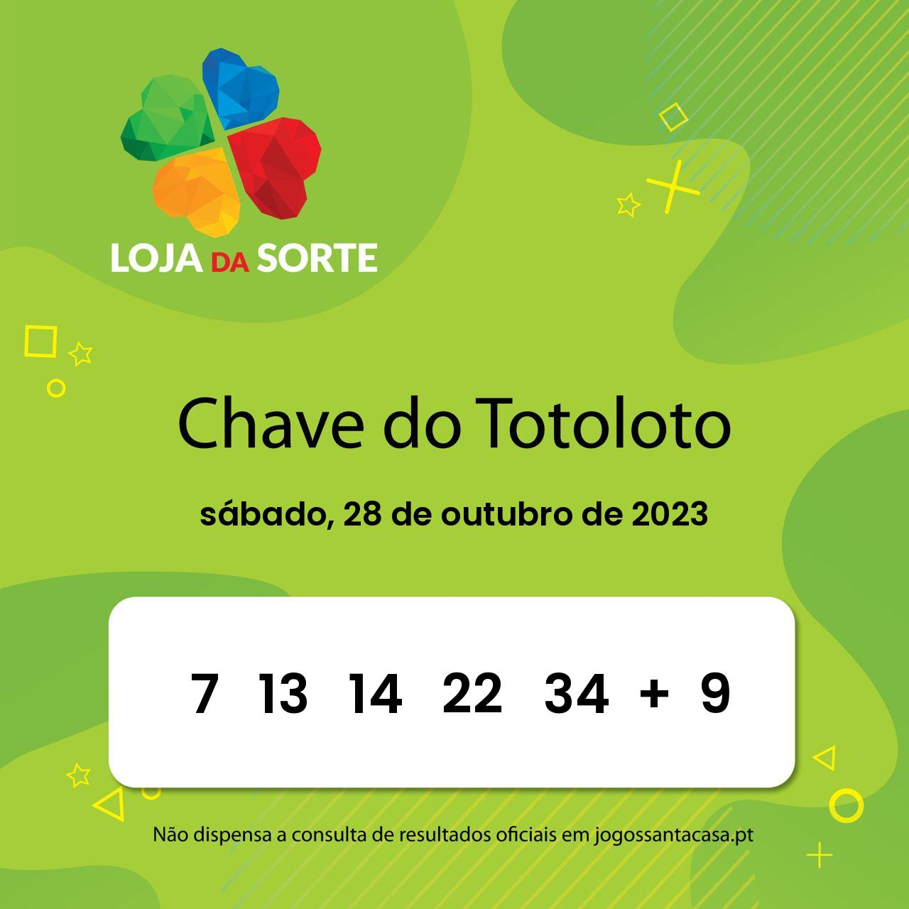

# lottery-results-facebook-autopost

## Installation

1. Clone the repository:

git clone https://github.com/DavidTrindade98/lottery-results-facebook-autopost
cd your_project

2. Create and activate environment folder:

python -m venv venv
source venv/bin/activate  # On Windows, use `venv\Scripts\activate`

3. Install the required packages:

pip install -r requirements.txt

4. Run the Program:

python main.py

(Will not be executed due to the lack of the Facebook page token)

## Folder Structure

- `main.py`: The main entry point of the program.
- `assets/`: Folder containing images and other resources used by the program.
- `requirements.txt`: List of required Python packages for the project.
- `env/`: Ignore this folder; it contains the virtual environment (automatically ignored by `.gitignore`).

I adapted the code later to post diferent real lottery games:

## Euromillion

## Totoloto

## M1lhão

